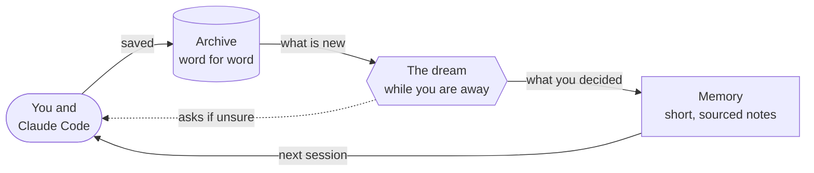
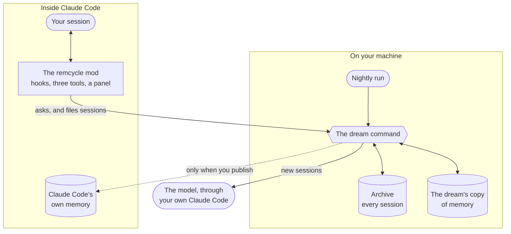

# remcycle

A Claude Code mod that gives it a nightly memory, built from its own sessions.

Claude Code starts every session fresh, and the notes it keeps about your projects pile up until the old ones are wrong. remcycle keeps everything you and Claude said, and while you are away it reads the new sessions, keeps what you actually decided, and questions the rest. The next session starts knowing it.



[How it works](docs/how-it-works.md) explains each part in plain words, with pictures.

## A mod, not a prompt

A skill or an instructions file is text that Claude reads and may or may not act on. remcycle is a mod: code that runs inside Claude Code and changes what a session does.

- **When a conversation starts**, it hands Claude what you have said and what earlier sessions left unfinished.
- **It gives Claude three tools.** `recall` searches past sessions, `close_thread` marks unfinished work done, and `settle_memory` applies a ruling the two of you reached.
- **It adds a panel.** `/remcycle` shows what it holds, and lets you rule on what it doubts.
- **When a session ends**, it files what was said.

Behind the mod is a program of its own, the `dream` command, with an archive, a nightly run, and checks that everything the dream writes to memory has to pass.



## What you get

- **Sessions that start informed.** Each new session is handed what you have said applies to all your work, what was learned about the project, and what earlier sessions left unfinished.
- **Memory you can trust.** Every memory points at the words it came from. Something only Claude concluded is never loaded as if you had said it, and a note you already had is never replaced without asking you.
- **A list that stays short.** Stale, repeated and contradictory notes are found and put to you, so what loads at the start of a session does not keep growing.
- **Recall.** Claude can search everything that was said in past sessions, get a summary of any the dream has read, and read the exact words back when it needs them.
- **A panel.** `/remcycle` shows what needs your ruling, what was learned lately and what is left open.
- **Everything on your machine.** The archive is one local file. The only thing that leaves is what the dream sends to the model, through your own Claude Code.

## Set it up by asking Claude

Paste this into Claude Code:

```text
Set up remcycle for me. Clone https://github.com/lianmatsuo/remcycle into ~/remcycle, or run git pull there if it is already cloned. Then read docs/setup-with-claude.md in that folder and follow it step by step.
```

Claude installs the command, asks which projects to leave out, and builds the archive. It stops and asks you before each of the three steps that cost model usage or change how Claude Code runs: the first dream, loading the mod in every session, and the nightly run. You can say no to any of them and turn it on later.

The folder has to stay where it is afterwards, because remcycle runs from it. [Removing it](docs/reference.md#removing-it) says how to undo each part.

To do it by hand, see [Install by hand](docs/reference.md#install-by-hand).

## What it does without asking

Once installed it only saves what was said and answers when you ask it something. The nightly dream, and the mod's part in every session, start when you turn them on.

Four things never happen without you: writing into the memory Claude Code itself loads, retiring or replacing a note you already had, deleting anything from the archive, and reading a project you have excluded.

## Find out more

- [How it works](docs/how-it-works.md): the idea, in plain words and pictures.
- [Reference](docs/reference.md): every command and setting.
- [Running it every night](docs/schedule.md): the scheduled task and the cron line.
- [Design notes](docs/intent.md): why it is built this way, and what was rejected.

## Status

This is early software, written for one person's machine and released as it stands. It reads Claude Code's transcripts and, when you ask it to, writes to the memory Claude Code loads, so read what a command will do before you run it.

It runs on macOS and Linux; Windows is untested. The mod was written against Claude Code 2.1.286, and its API is early access, so it can break between releases.

remcycle is an independent project and is not affiliated with or endorsed by Anthropic.

## Development

```bash
scripts/check
```

That runs everything CI runs: the Python lint and tests, then the mod's manifest, types and tests. [CONTRIBUTING.md](CONTRIBUTING.md) says how to start, and [AGENTS.md](AGENTS.md) is the working guide for people and coding agents alike.

The Python tests sit at these seams: transcript parsing, the archive against a real SQLite file, settings, reconciliation as pure functions, the memory store against folders in Claude Code's format, extraction through a stand-in for the model, the gate, and whole dream runs against temporary folders.

The mod's tests run in Claude Code's own plugin test kit, so that half of the check needs Claude Code installed.

## Licence

Apache-2.0. See [LICENSE](LICENSE). Copyright 2026 Lian Matsuo, as [NOTICE](NOTICE) says.
