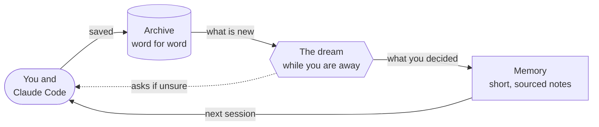
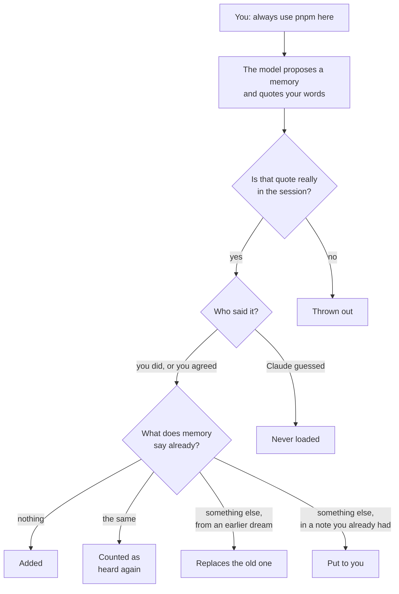
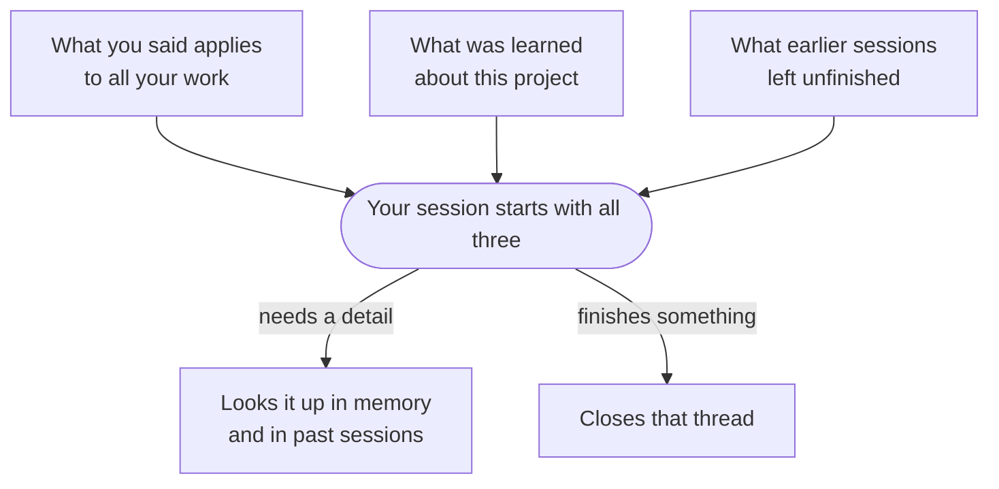
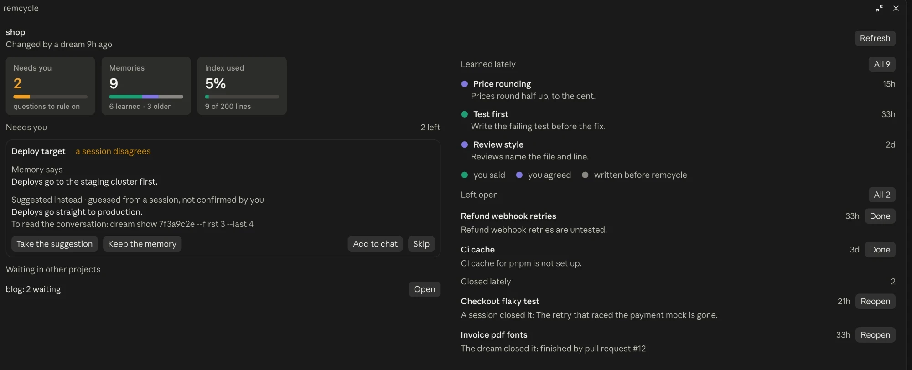

# How remcycle works

Claude Code starts every session fresh. It has a memory folder for each project, but the notes in it are written in the moment, nobody checks them against each other, and they pile up until the oldest are wrong and the list is too long to load.

remcycle gives that memory a night shift. It keeps everything you and Claude said, and while you are away it reads the new sessions, keeps what you actually decided, and throws out or questions the rest.

## The loop

There are three parts.

**The archive** is one file on your machine. When a session ends, what you typed and what Claude wrote back go into it, word for word. What tools printed is left out, which is most of a session's bulk. Text that looks like a password or a key is blanked before it is stored. Nothing in the archive is ever sent anywhere by the archive.

**The dream** is a command that runs once a day, started in the background by the first session after 20 hours, or whenever you run it. It reads only the sessions it has not read before. To read one it uses the model through your own Claude Code, the same way a session would, so this is the step that uses your plan.

**The mod** is a small add-on inside Claude Code. It hands each new session what the dream learned, lets Claude look things up, and gives you a panel to see and steer it all.

## What happens to something you say

Say that in the middle of a session you tell Claude: "always use pnpm here".

A model is used for one step only: reading the session and proposing what is worth keeping, each with the words it is based on. Everything after that is ordinary code with fixed rules.

- **No quote, no memory.** If the words the model quotes are not in the session, the proposal is dropped.
- **Your words count for more than Claude's.** Something you typed, or agreed to, can become a memory. Something Claude concluded by itself is never loaded: a lesson is kept on file where a search can find it, and anything else is dropped.
- **A note you already had is never replaced behind your back.** If a session disagrees with a note that was there before remcycle, you are asked. A memory the dream wrote is replaced when you later say something newer.
- **The same thing heard twice is one memory**, with two sources.

Before any of this is accepted, the dream works on a spare copy and checks it: nothing vanished, nothing was reworded without a record, the list still fits what Claude Code will load, and a model shown only the list can still find the right note. A copy that fails is discarded and the sessions are read again next time.

## Three kinds of memory

| | What it holds | When a session sees it | How long it lasts |
|---|---|---|---|
| **Open threads** | Work a session left unfinished | At the start of every session in that project | Two weeks, unless it comes up again |
| **Memories** | One decision, preference or fact each, with where it came from | At the start, as a short list | Until you or a later session replace it |
| **The archive** | Everything that was said | Only when Claude looks something up | Always |

The split is deliberate. What hurts a model is not what sits on disk but what is put in front of it every time. So the list that loads is kept short, and the detail stays a lookup away.

A lookup does not load a whole session either. A search returns the few turns that match, and for each session they came from that the dream has read, the short summary it wrote then. Claude reads the turns themselves only when it needs the exact words.

A thread closes when the session that finishes the work says so, when a later session's transcript shows it done, when a commit or merged pull request in the project did it, or when you press Done. A session that closes a thread has to say what finished it, and the next dream checks that against the session's own transcript.

## How a session gets its memory

The mod hands these over when a conversation starts. None of it is written into Claude Code's own memory folder, so turning the mod off undoes it.

There is one thing a handed-over list cannot do: take a stale note out of the folder Claude Code loads by itself, or shorten that folder's contents page when it is nearly full. For that there is `dream publish`. It shows you exactly what it would add, replace and remove, writes only when you say so, and keeps a copy of what was there.

## The panel

Type `/remcycle` in any session. The panel shows:

- **Needs you**: memories a session or a review has put in question, one at a time, with what the memory says and why it is doubted. You keep it, retire it, take the suggestion, or add it to the chat to talk it through.
- **Memories**: how many there are, and where they came from.
- **Index used**: how full the list is that Claude Code loads at the start. This is the number remcycle exists to keep low.
- **Learned lately**, **Left open** and **Closed lately**, each with a button to see the whole list.

## What stays in your hands

Once installed, two things run by themselves: the mod, which hands memory to every session, and the daily dream, which uses your Claude plan to read new sessions. `dream daily off`, or the switch in the panel, turns the dream off.

Four things never happen without you:

- writing into the memory Claude Code itself loads (`dream publish`);
- retiring or replacing a note you already had;
- deleting anything from the archive (`dream purge`);
- reading a project you have listed as excluded.

The exact rules, every command and every setting are in the [reference](reference.md). Why it was built this way, and what was rejected, is in the [design notes](intent.md).
